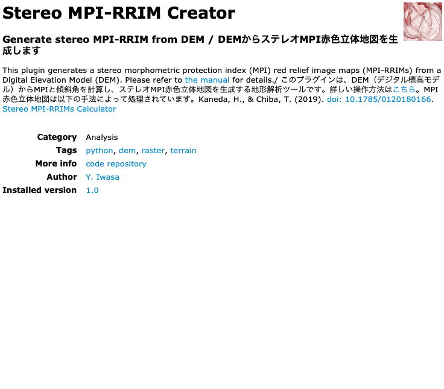
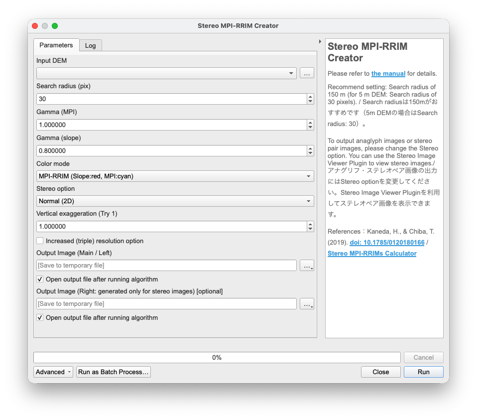
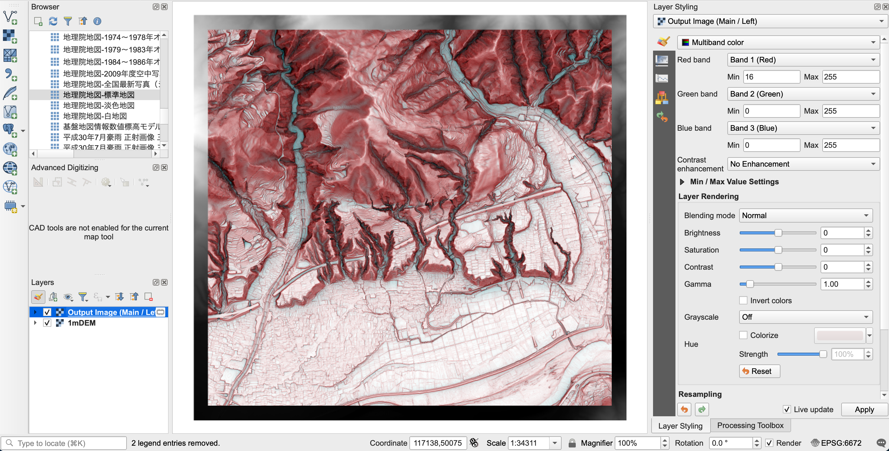

# Stereo MPI-RRIM Creator Plugin for QGIS

### English | [日本語](#japanese-日本語)

# English
## Overview
**Stereo MPI-RRIM Creator** is a QGIS plugin that generates Stereopaired Morphometric Protection Index Red Relief Image Maps (Stereopaired MPI-RRIMs) from Digital Elevation Models (DEMs).

In addition to 2D images, it supports the generation of anaglyph and stereopaired images (parallel viewing and cross-eyed viewing).

If you use this plugin in your research, please cite Kaneda and Chiba (2019).

## Key Features
* **Generate MPI-RRIMs**: Calculates the MPI (Morphometric Protection Index) and slope from a DEM to generate an MPI-RRIMs.
* **Color Modes**: In addition to the standard MPI-RRIM (Slope: Red, MPI: Cyan), a "Blue" option (Slope: Black, MPI: Cyan) is available. This is useful when overlaying other features and avoiding visual clutter.
* **Stereo Output Support**:
  * Normal (2D image)
  * Anaglyph
  * Stereopaired (parallel viewing)
  * Stereopaired (cross-eyed viewing)
* **Increased (Triple) Resolution Option**: By internally resampling the DEM to triple its resolution before processing, this option reduces the terracing effect and enables more detailed geomorphic interpretation.

## Installation
* **Download directly from the QGIS Plugin Repository**
  * Open QGIS, go to "Manage and Install Plugins...", search for "Stereo MPI-RRIM Creator", and install it.
  * Icon will be added to top panel, or you can find "Stereo MPI-RRIM Creator" in the Processing Toolbox.

* **Download from this repository**
  * Click "Code" at the top of this page and select "Download ZIP" to download the repository.
  * Open QGIS, go to "Manage and Install Plugins...", select "Install from ZIP", and choose the downloaded ZIP file.
  * Enable the plugin.
  * Icon will be added to top panel, or you can find "Stereo MPI-RRIM Creator" in the Processing Toolbox.

## Usage & Parameter Tips
* **Input DEM**: Select a DEM projected in a metric Cartesian (x, y) coordinate system. Geographic coordinate systems (latitude/longitude in degrees) are not supported.
  * Note that the output MPI-RRIM will be smaller than the input DEM by the *Search radius*. If splitting large DEMs into tiles using GDAL **Retile** (`gdal:retile`), set the **Overlap** parameter to `Search radius * 2` (e.g., `600` for a 0.5m DEM; `300` for a 1m DEM).
* **Search radius (pix)**: It is recommended to set this value equivalent to an actual distance of **150 meters**.
  * *Example:* `150` for a 1m DEM; `30` for a 5m DEM.
* **Gamma**: Adjusts the contrast. If you want to visualize valley bottoms darker, set a lower MPI Gamma value (e.g., `0.8`).
* **Color mode**: Normally, select `MPI-RRIM`. If the red color becomes too visually noisy when overlaying other features on the map, you can use the `Blue` option, which visualizes the slope in black instead.
* **Stereo option**: You can choose standard 2D output `(Normal (2D))`, `Anaglyph`, or stereopaired images `(Stereopaired (parallel viewing) or Stereopaired (cross-eyed viewing))`. Note that if you select stereopaired images, two separate image files (for the left and right eyes) will be generated. **You can view them stereoscopically using the [Stereo Image Viewer Plugin](https://github.com/yiwasa/Stereo-Image-Viewer).**
* **Vertical exaggeration**: Adjusts the vertical exeggerarion of the stereo images. Unlike generating with Simple DEM Viewer, an exaggeration of `1` produces a relatively strong exeggeration.
* **Increased (triple) resolution option**: Checking this option triples the DEM resolution internally. This reduces the terracing effect (Flat areas appear terraced, which poses a problem for interpreting micro-topography) but increases processing time.

If you select “Normal (2D)” or ‘Anaglyph’ in the Stereo option, a warning such as “The following layers were not correctly generated. ~OUTPUT_RIGHT.tif” may appear after execution. Since the image generation was successful, you can safely ignore this warning. If you do not want this warning to appear, uncheck the “Open output file” box under Output Image (Right).

## Screenshots

### Plugin execution example

*Example: Running the plugin and displaying the generated DEM in QGIS.*

### Plugin image

### Processing tool dialog

### Output DEM example

### Create and display stereopaired images using [Stereo Image Viewer Plugin](https://github.com/yiwasa/Stereo-Image-Viewer)

## Citation
When publishing research papers using this plugin, please cite the following paper and explicitly state that this plugin was used.

Kaneda, H., and T. Chiba (2019), Stereopaired morphometric protection index red relief image maps (Stereo MPI-RRIMs): effective visualization of high-resolution digital elevation models for interpreting and mapping small tectonic geomorphic features, Bull. Seismol. Soc. Am., 109, 99–109. [https://doi.org/10.1785/0120180166](https://pubs.geoscienceworld.org/ssa/bssa/article-abstract/109/1/99/567965/Stereopaired-Morphometric-Protection-Index-Red?redirectedFrom=fulltext)

## About MPI-RRIM
MPI-RRIM is an improved topographic visualization method proposed by [Kaneda and Chiba (2019)](https://pubs.geoscienceworld.org/ssa/bssa/article-abstract/109/1/99/567965/Stereopaired-Morphometric-Protection-Index-Red?redirectedFrom=fulltext) based on the [Red Relief Image Map (RRIM)](https://www.rrim.jp/en/) ([Chiba and Suzuki, 2004](https://www.researchgate.net/publication/330634466_chiselitidetu-xinshiidexingbiaoxianshoufa-'Red_Relief_Image_Map'-The_new_visualization_method_qianyedalang_lingmuxiongjie): [Chiba et al., 2008](https://www.isprs.org/proceedings/XXXVII/congress/2_pdf/11_ThS-6/08.pdf)).

This plugin implements the generation of MPI-RRIMs and stereopaired images based on the methodologies detailed in Kaneda and Chiba (2019) and the [Stereo MPI-RRIMs Calculator](https://civil.r.chuo-u.ac.jp/lab/geology/5_mrrim/mrrim.html).

## Acknowledgments
I would like to express my deepest gratitude to Dr. Heitaro Kaneda of Chuo University for providing valuable insights and feedback regarding the MPI-RRIM generation methodology and the addition of new features during the development of this plugin.

Google's Gemini was used to assist with algorithm design, debugging, code refactoring, and drafting this README documentation for the creation and improvement of this plugin and its source code.

All final design decisions, verifications, and operational tests were strictly conducted by the author.

## License
[GNU General Public License v3.0](LICENSE)

# Japanese (日本語)

## 概要
**Stereo MPI-RRIM Creator** は、DEM（数値標高モデル）からステレオMPI赤色立体地図（Stereopaired MPI-RRIM）を作成するQGISプラグインです。

通常の2D画像のほかに、アナグリフ画像やステレオペア画像（平行法・交差法）の生成に対応しています。

このプラグインを使って論文を書く際にはKaneda and Chiba (2019)を引用してください。

## 主な機能
* **MPI-RRIMの生成**: DEMからMPI（Morphometric Protection Index：保護指数）と傾斜角を計算してMPI赤色立体地図を生成します。
* **カラーモード**: MPI赤色立体地図（傾斜:赤, MPI:シアン）のほかに、傾斜を黒で表現した「Blueのオプションも選択可能。他の情報を重ねたい場合に有用です。
* **ステレオ出力対応**:
  * 通常（2D画像）
  * アナグリフ画像
  * ステレオペア画像（平行法）
  * ステレオペア画像（交差法）
* **3倍解像度生成オプション**: 処理前にDEMを内部で3倍の解像度にリサンプリングしてから計算を行うことで、テラス効果を低減しつつ、より詳細な地形判読が可能となります。

## インストール方法
* QGISプラグインリポジトリから直接ダウンロード
  * QGISを起動し、「プラグインの管理とインストール」から「Stereo MPI-RRIM Creator」を検索し、追加
  * 上部パネルにアイコンが追加、もしくはプロセシングツールボックスに「Stereo MPI-RRIM Creator」が追加

* このリポジトリからダウンロード
  * このページ上部の「Code」から「Download ZIP」を選択し、ZIP形式でダウンロードします。
  * QGISを起動し、「プラグインの管理とインストール」から「ZIPからインストール」でダウンロードしたZIPファイルを選択
  * プラグインを有効化
  * 上部パネルにアイコンが追加、もしくはプロセシングツールボックスに「Stereo MPI-RRIM Creator」が追加

## 使い方・パラメータのコツ
* **Input DEM**: メートル単位の直交座標（x, y）のDEMを選択してください。緯度経度の地理座標系は対応していません。日本国内のDEMを準備する場合には、**PngTile2Demプラグイン**を利用することができます。
  * MPI-RRIMsはSearch radius分だけ元のDEMよりも狭い範囲で生成されることに注意してください。広範囲のDEMを分割して処理をする場合には、QGISのプロセシングツールボックスから、「GDAL」→「ラスタその他」→「タイルを再タイル化」（gdal:retile）を利用して、「隣接するタイルと重なるピクセル数」のオプションに`検索半径*2`（0.5mDEM: 150/0.5*2=600、1mDEM: 150/1*2=300）の数を入力してください。
* **Search radius (pix)**: 実距離で **150m** 相当になるように設定することをおすすめします。
  * 例: 1m DEMの場合は `150`。5m DEMの場合は `30`。
* **Gamma**: コントラストを調整します。谷底をより暗く表現したい場合は、MPIのGammaを小さく（例：`0.8`など）設定してください。
* **Color mode**: 通常はMPI-RRIMを選択してください。地形表現図の上にほかの地物を重ねて地図を作成する際に、赤色が煩雑になる場合には傾斜を黒色で表現した`Blue`のオプションを利用することができます。
* **Stereo option**: MPI赤色立体地図の画像`（Normal (2D)）`だけでなく、アナグリフ画像`（Anaglyph）`やステレオペア画像（平行法・交差法）`（Stereopaired (parallel viewing) or Stereopaired (cross-eyed viewing)）`を選択できます。なお、ステレオペア画像を選択した場合には、左目用と右目用の2枚の画像が出力されます。左画像は変形をしていない画像なので、ほかの情報と重ねて表示することができます。**[Stereo Image Viewer Plugin](https://github.com/yiwasa/Stereo-Image-Viewer)を利用することでステレオ実体視を行うことができます。**
* **Vertical exaggeration**: ステレオ画像の過高感を調整します。Simple DEM Viewerで作成する場合と違い、`1`でも過高感が強めです。
* **Increased (triple) resolution option**: チェックを入れるとDEMの解像度が3倍になり、微地形を実体視判読する際に問題となるテラス効果（平坦な地形が段々畑のように見える）が低減しますが、処理時間が長くなります。

Stereo optionで「Normal (2D)」または「Anaglyph」を選択した場合、実行後に「次のレイヤは正しく生成されませんでした。〜OUTPUT_RIGHT.tif」という警告が出ることがあります。

画像生成は正常に成功していますので、無視していただいて問題ありません。警告を出したくない場合は、Output Image(Right) の「出力ファイルを開く」のチェックを外してください。

## スクリーンショット

### 実行デモ

### プラグイン画面

### 処理ツール画面

### 出力された DEM の表示例

### ステレオペア画像を[Stereo Image Viewer Plugin](https://github.com/yiwasa/Stereo-Image-Viewer)で表示するデモ

## 出典の明記について
本プラグインを用いて研究論文を発表する際には、以下の論文を引用するとともに、プラグインを利用した旨を明記してください。

Kaneda, H., and T. Chiba (2019), Stereopaired morphometric protection index red relief image maps (Stereo MPI-RRIMs): effective visualization of high-resolution digital elevation models for interpreting and mapping small tectonic geomorphic features, Bull. Seismol. Soc. Am., 109, 99–109. [https://doi.org/10.1785/0120180166](https://pubs.geoscienceworld.org/ssa/bssa/article-abstract/109/1/99/567965/Stereopaired-Morphometric-Protection-Index-Red?redirectedFrom=fulltext)

## MPI赤色立体地図について
2002年に開発され、[千葉・鈴木（2004）](https://www.researchgate.net/publication/330634466_chiselitidetu-xinshiidexingbiaoxianshoufa-'Red_Relief_Image_Map'-The_new_visualization_method_qianyedalang_lingmuxiongjie)や[Chiba et al. (2008)](https://www.isprs.org/proceedings/XXXVII/congress/2_pdf/11_ThS-6/08.pdf)により提示された[赤色立体地図](https://www.rrim.jp/)を改良した地形表現手法がMPI赤色立体地図です。

MPI赤色立体地図は[Kaneda and Chiba (2019)](https://pubs.geoscienceworld.org/ssa/bssa/article-abstract/109/1/99/567965/Stereopaired-Morphometric-Protection-Index-Red?redirectedFrom=fulltext)により提示された手法であり、本プラグインではKaneda and Chiba (2019)および[Stereo MPI-RRIMs Calculator](https://civil.r.chuo-u.ac.jp/lab/geology/5_mrrim/mrrim.html)の手法を参考に、MPI赤色立体地図の生成機能およびステレオ画像の生成機能を実装しています。

## 謝辞
本プラグインの作成にあたって、中央大学の金田平太郎博士にはMPI赤色立体地図の生成手法や機能の追加に関して貴重なご意見をいただきました。厚く御礼申し上げます。

本プラグインおよびソースコードの作成・改良にあたっては、GoogleのGeminiを用い、アルゴリズム設計、デバッグ、コード整理および README 文書作成の補助を受けました。

最終的な設計判断、検証、動作確認はすべて作者自身が行っています。

---
## License
[GNU General Public License v3.0](LICENSE)